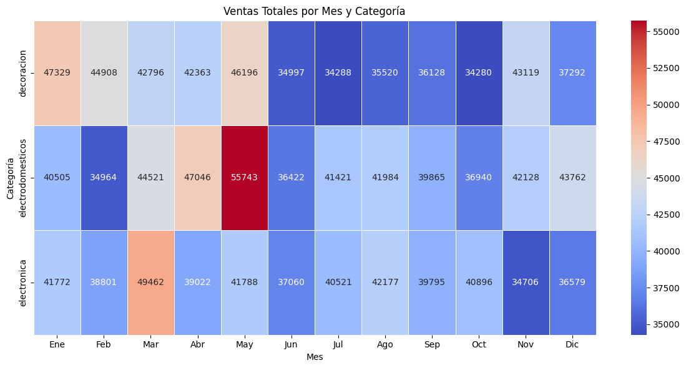
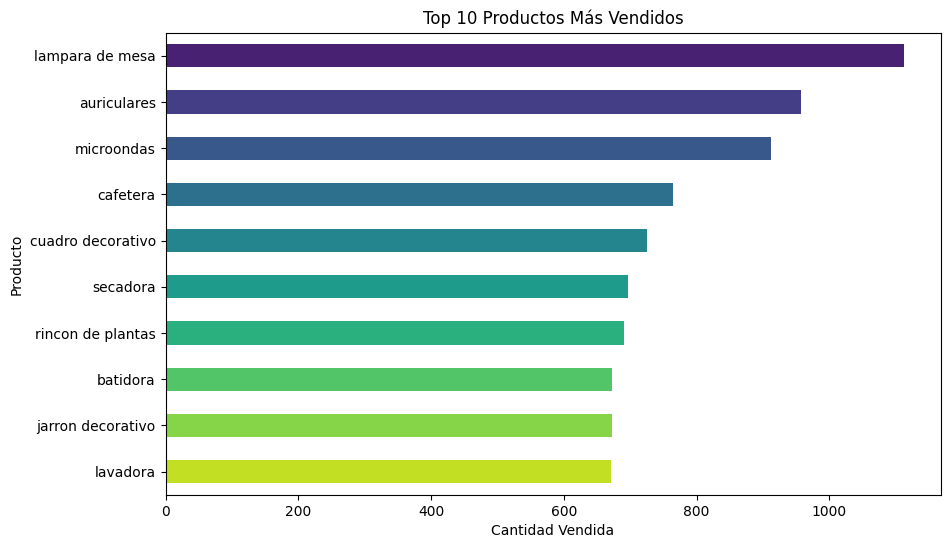

# Análisis de ventas y marketing con Python

Análisis exploratorio de 3.000 ventas de un retail durante 2024: limpieza, KPIs, productos y categorías, estacionalidad y cruce con campañas de marketing. Proyecto final del curso Análisis de Datos con Python (Talento Tech, 2025), con una revisión posterior en la que corregí tres errores del análisis original.

**Herramientas:** Python · pandas · NumPy · SciPy · Matplotlib · Seaborn · Jupyter / Google Colab



## Problema

Un retail quería entender su desempeño en 2024: cuánto facturó, qué productos y categorías sostienen el negocio, cómo se mueven las ventas en el año y si las campañas de marketing se relacionan con las ventas.

## Datos

Tres archivos provistos por el curso, con datos simulados (`data/`):

- `ventas.csv`: 3.035 registros con producto, precio, cantidad, fecha y categoría.
- `marketing.csv`: 90 campañas, 3 por producto (TV, redes sociales y email), con costo y fechas de inicio y fin.
- `clientes.csv`: 567 clientes con edad, ciudad e ingresos. No se puede cruzar con las ventas porque las ventas no tienen ID de cliente, así que no lo usé en el análisis.

`Sets de datos.pdf` es la descripción de los archivos entregada por el curso.

## Método

1. **Limpieza:** eliminé 35 ventas duplicadas y 2 con valores nulos (quedan 2.998), saqué el símbolo `$` del precio, convertí fechas y normalicé textos (minúsculas, sin tildes).
2. **Transformación:** calculé el ingreso de cada venta (precio × cantidad) y marqué como "alto rendimiento" a los productos por encima del percentil 80 de ingreso.
3. **Agregación:** ingreso y ticket promedio por categoría, producto y mes.
4. **Estadística descriptiva:** media, mediana, moda, rango, varianza y desvío del ingreso por venta.
5. **EDA:** distribuciones, boxplots, evolución semanal y mensual, y mapas de calor por producto y categoría.
6. **Revisión posterior:** una sección al final del notebook con las correcciones que se detallan más abajo.

## Resultados

**KPIs 2024:** USD 1.467.094 de ingreso, 2.998 ventas, 19.495 unidades y un ticket promedio de USD 489,36.

**El ingreso por venta es asimétrico.** La media (USD 489) está por encima de la mediana (USD 418), con un desvío de USD 334: hay ventas grandes que empujan el promedio hacia arriba.

**Categorías parejas.** Electrodomésticos lidera con USD 505.300, seguida de electrónica (USD 482.578) y decoración (USD 479.216).

**Seis productos de alto rendimiento.** De 30 productos, seis superan el percentil 80 de ingreso (USD 52.519): lámpara de mesa (USD 82.276), auriculares (USD 74.176), microondas (USD 72.563), cafetera, cuadro decorativo y smartphone.



**Mayo es el mejor mes y junio el peor.** Mayo suma USD 143.727, impulsado por electrodomésticos (USD 55.743, el valor más alto del mapa de calor). Junio cae a USD 108.480.

**Precio y cantidad no se relacionan.** La correlación entre el precio unitario y la cantidad por operación es de −0,002.

**Ventas durante las campañas.** De las 2.998 ventas, 768 ocurrieron mientras su producto tenía una campaña activa. Esas ventas suman USD 152.161 en email, USD 139.197 en TV y USD 125.450 en redes sociales. Es una asociación: no hay un grupo sin campaña para comparar, así que no mide el efecto de cada canal.

### Qué corregí en la revisión

| Análisis original | Problema | Corrección |
|---|---|---|
| Ventas mensuales (Etapa 1) | Sumaba solo el precio, sin multiplicar por la cantidad (enero daba USD 20.097) | Ingreso = precio × cantidad (enero: USD 129.605) |
| Correlación (Etapa 3) | Comparaba cantidad contra ingreso, que están relacionados por definición | Correlación entre precio y cantidad, como pedía la consigna |
| Ventas por canal de marketing | Unía ventas y campañas solo por producto: cada venta se contaba tres veces y los tres canales daban el mismo total (USD 1.467.094) | Cruce por producto y por fecha dentro de la vigencia de cada campaña |

## Cómo ejecutarlo

Requisitos: Python 3.11 o superior.

```bash
git clone https://github.com/EmiiFernandez/analisis-ventas-marketing-python.git
cd analisis-ventas-marketing-python
pip install -r requirements.txt
jupyter notebook notebook/proyecto_final_fernandez_emilia_comision_25262.ipynb
```

El notebook lee los CSV desde `../data/`. En Google Colab, subir la carpeta `data/` y ajustar la ruta.

## Estructura del repo

```
analisis-ventas-marketing-python/
├── data/
│   ├── ventas.csv
│   ├── marketing.csv
│   ├── clientes.csv
│   └── Sets de datos.pdf     # descripción de los datos (curso)
├── images/                   # gráficos usados en este README
├── notebook/
│   └── proyecto_final_fernandez_emilia_comision_25262.ipynb
├── requirements.txt
└── LICENSE
```

## Próximos pasos

- Medir el efecto de las campañas comparando cada producto durante y fuera de su campaña, y calcular el retorno por canal con los costos.
- Pasar la limpieza a funciones reutilizables en un módulo `.py` con tests.
- Si se agrega el ID de cliente a las ventas, segmentar clientes por edad, ciudad e ingresos.

---

Emilia Fernández · [LinkedIn](https://www.linkedin.com/in/emiliafernandez) · Licencia MIT
